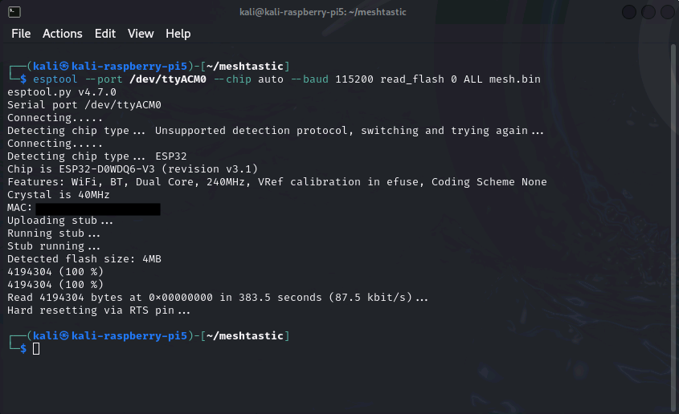

# Meshtastic Parser

This guide covers the extraction and decoding of data from ESP32 based Meshtastic nodes including the popular Lilygo and Heltec devices. From analyzing the device channel lists and other data can be obtained.

Once the data is extracted from the device it can be decoded with the included script. The script will require internet connectivity the first time it is run so it can load the required protobufs.


---

## Extraction of data

A number of extraction options exist for extraction of data from ESP32 devices, this guide will cover extracting the data via USB cable. Data extraction can also be achieved by removing and directly reading the flash memory IC from the board.


>The USB extraction method will boot the device and increment the boot counter twice. The reboot counter will be incremented upon powering the device and once more when the device is rebooted after the flash memory has been dumped.
>Powering the device may also connect it to the local mesh network, if that is a consideration add a terminating load or attenuator to the device in place of or in line with the antenna. Powering the device without an antenna will likely harm the radio within.


## Required tools
To complete this task the following tools will be required.
- A computer or Raspberry Pi with a Linux distribution of your choice. Ubuntu or Kali are suggested
- An internet connection for installing the required tools
- A USB cable to interface with the target device

---

## USB Extraction with Esptool
The Espressif provided Esptool (https://docs.espressif.com/projects/esptool/en/latest/esp32/) can be utilized to dump the memory from the device. Due do problems with the packaging of Esptool among a number of Linux distributions it is suggested you read the below section in relation to stub flasher errors and gather the required files before proceeding.

----
As this process will generate a number of files create a working folder i.e `mkdir meshtastic` and navigate into it `cd meshtastic`

Ensure Esptool is installed on your system
`sudo apt-get install esptool`

The following command is an example of how to dump all of the flash memory of a connected ESP32 based device to file named *mesh.bin*. This command may need to be modified to suit your system or device.

`esptool --port /dev/ttyACM0 --chip auto --baud 115200 read_flash 0 ALL mesh.bin`

This command will dump the entire flash of the device to a file named *mesh.bin*

- `/dev/ttyACM0` is the location of the serial port for your target device. This may not be correct for your device if you have a number of peripherals connected.  To resolve this connect the target device and run `dmesg` to show the port the device is connected to
- Heltec devices will likely show as `/dev/ttyUSB0 ` due to the USB to the serial chip-set used
- Alternative baud rates such as `--baud 921600` may be faster but can be incompatible with some chips

### Locating The Serial Port
The image below shows the output of `dmesg` after a Heltec device was connected. The serial interface is therefore located at `/dev/ttyUSB0`


### Stub Flasher Errors
This first time this is attempted it will likely result in the following error depending on your Linux distribution.

**LilyGo Devices**
	`FileNotFoundError: [Errno 2] No such file or directory: '/usr/lib/python3/dist-packages/esptool/targets/stub_flasher/stub_flasher_32.json'`

**Heltec Devices**
	`FileNotFoundError: [Errno 2] No such file or directory: '/usr/lib/python3/dist-packages/esptool/targets/stub_flasher/stub_flasher_32s3.json'`
`

This error can be resolved by following the instructions at the bottom of this readme. 

If you did not install `esptool` using `sudo apt-get install esptool` this directory my be different, but check the error message shown above for the correct path.

>[!info]
>These stub files are stored within a system folder and root access will be needed to copy the files.
>If you are copying the stub files via the File Explorer you will need to right click in a blank space in the folder and select open as root. You will then be presented with a new explorer window with root access

Once the stub files have been copied across a successful extraction will then complete.



## Hashing The Extraction
The following command will then hash the file and save it to *hash.txt*
`md5sum < mesh.bin > hash.txt`

```
└─$ md5sum < mesh.bin > hash.txt && cat hash.txt
fc4218e0d0d8dac57c6d82d2da7bb03d 
```

## Stub flashers
Due to packaging errors stub files were not correctly added to Debian repositories and are not automatically installed.

Required Stub files can be obtained from here but must be renamed prior to use
https://github.com/espressif/esptool/tree/master/esptool/targets/stub_flasher/2 

The file in the repository will be labelled `esp32s3.json` but will require renaming to `stub_flasher_32s3.json` to function

Stub files have been provided however an alternative is to obtain and run esptool from source https://github.com/espressif/esptool/tree/master
