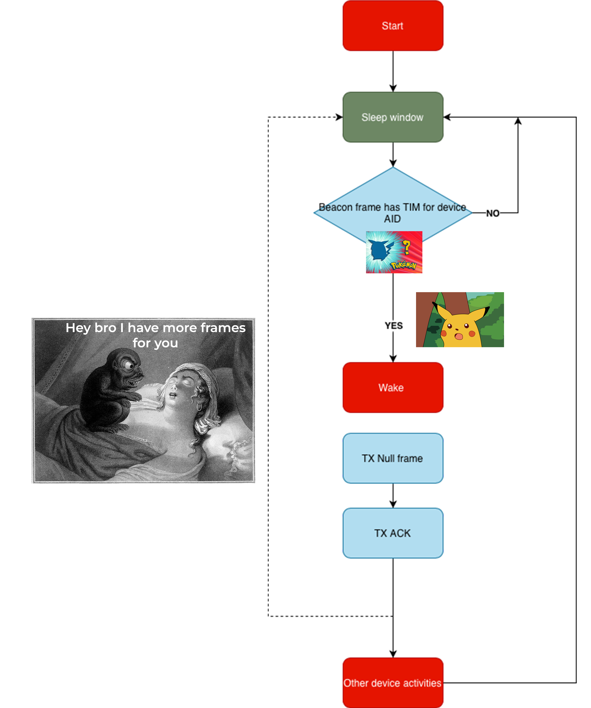

# Wifi Sleep Paralysis

Abuses the DTIM component of the AP Beacon to force some sleeping devices to come awake, further details in the script. The traffic information map can be used to indicate there is buffered data waiting for a device. As battery powered devices aim to save power they may wake periodically to check if there is buffered data waiting for them before fully waking up.

If a frame indicating data is waiting for them is sent they will be brought into an awake state. This can be monitored with airodump-ng or wireshark. If the frames are continually sent the device will not be able to remain in its sleeping state

eg -  `sudo airodump-ng --beacons --showack --bssid A0:00:00:00:00:00  --channel 1 wlan1`

Note the addition of the `showack` and `beacons` flags. `--showack` will show the ack frames are being broadcast from the client so you can watch the count rise . `--beacons` is required if you are saving the output to a file so the beacons are recorded.

# Usage

usage: paralysis.py [-h] -b BSSID -s SSID -c CHANNEL (--aid AID | --all) [-i INTERFACE] [-t INTERVAL] [--dtim-count DTIM_COUNT] [--dtim-period DTIM_PERIOD]
                    [--show-packet] [-v]

Eg:
Target device id 1 on the following network

- BSSID A0:00:00:00:00:00
- SSID NETGEAR

`paralysis.py -b A0:00:00:00:00:00  -s NETGEAR -c 1 -i wlan2mon --aid 1`

The --all flag can be used to wake all station on the same network.

`paralysis.py -b A0:00:00:00:00:00  -s NETGEAR -c 1 -i wlan2mon --all`

## Testing notes

### macchanger

This script seems to work more reliably of if macchanger is used to match the WI_Fi cards MAC to the target network.

eg: `sudo macchanger -m A0:00:00:00:00:00 wlan0mon`

### Speed

The speed at which targets are awoken seems to depend on the Wi_fi card used to transmit the frames. Known good cards such as the Mediatek MT7612U seem to have a much faster effect than cards with problematic drivers such as the Realtek RTL8812AU.

### Security

Use of this against a modern AP such as *Ubiquiti Unifi* will cause a rogue AP warning to be generated

## References

- [IEEE 802.11-2012 Standard](https://standards.ieee.org/standard/802_11-2012.html)
- [Wikipedia: Traffic Indication Map](https://en.wikipedia.org/wiki/Traffic_indication_map)
- [Linux Wireless Documentation](https://wireless.docs.kernel.org/en/latest/en/developers/documentation/ieee80211/power-savings.html)

## Legal Notice

This tool is for educational and authorized security testing purposes only. Unauthorized use against networks you don't own or have permission to test is illegal in most jurisdictions. Always obtain written authorization before testing.
